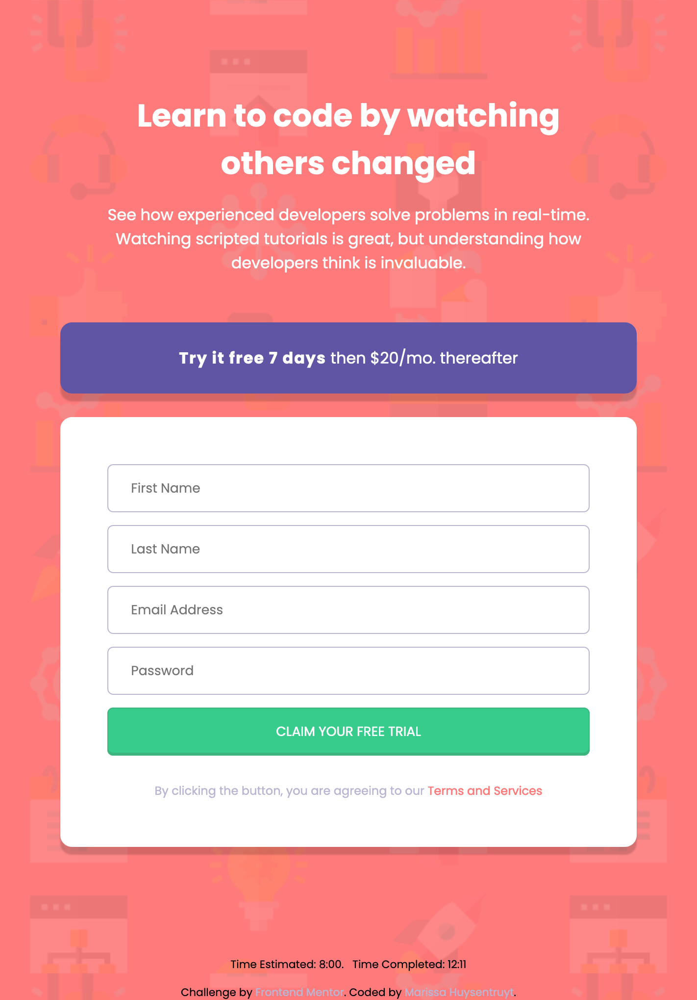

# Frontend Mentor - Intro component with sign up form


This is a solution to the [Intro component with sign up form challenge on Frontend Mentor](https://www.frontendmentor.io/challenges/intro-component-with-signup-form-5cf91bd49edda32581d28fd1). Frontend Mentor challenges help you improve your coding skills by building realistic projects. 

## Table of contents

- [Welcome & Overview](#welcome-👋)
  - [The challenge](#the-challenge)
  - [Where to find everything](#where-to-find-everything)
  - [Running this project](#running-this-project)
  - [Deploying this project](#deploying-this-project)
  - [Screenshot](#screenshot)
  - [Links](#links)
- [My process](#my-process)
  - [Built with](#built-with)
  - [What I learned](#what-i-learned)
  - [Continued development](#continued-development)
  - [Useful resources](#useful-resources)
- [Author](#author)

**To do this challenge, you need a basic understanding of HTML, CSS and JavaScript.**
## Welcome 👋

This is a fairly typical looking sign-up form. This is my first attempt at using JavaScript to validate form entry, and it's not working quite as I hoped. There's still some bugs to work out. 

## The challenge

Build out this introductory component and get it looking as close to the design as possible.

Users should be able to:

- View the optimal layout for the site depending on their device's screen size
- See hover states for all interactive elements on the page
- Receive an error message when the `form` is submitted if:
  - Any `input` field is empty. The message for this error should say *"[Field Name] cannot be empty"*
  - The email address is not formatted correctly (i.e. a correct email address should have this structure: `name@host.tld`). The message for this error should say *"Looks like this is not an email"*

**Note: Unfortunately, regardless of the validation status, the submit button changes to "success text".**

## Where to find everything

If you would like to see the static design files, you may find them in the `/design` folder. You'll see both a mobile and a desktop version. 

There is also a `style-guide.md` file containing the information regarding the designs, such as color palette and fonts.

## Running This Project

There's not active development server for this project, so you'll have to make changes, pull the `index.html` file into your browser, and refresh in order to see your changes.

## Deploying this project

There are many ways to host your project for free. Recommended hosts are:

- [GitHub Pages](https://pages.github.com/)
- [Vercel](https://vercel.com/)
- [Netlify](https://www.netlify.com/)

You can see this deployed version via GitHub Pages [here](https://marissahuysentruyt.github.io/intro-component-sign-up-form/). 

### Screenshot



### Links

- Most Recent Solution URL: [Angular Solution](https://your-solution-url.com)
- This Solution: [Vanilla JS Solution](https://www.frontendmentor.io/solutions/createelement-insertadjacentelement-for-loop-6ntGyjyYFO)
- Live Site URL: [Live Site](https://marissahuysentruyt.github.io/intro-component-sign-up-form/)

## My process

This project was built with plain HTML, CSS & JavaScript. As someone who really enjoys the details of the user interface, I started with the HTML & CSS, building desktop first (although now I understand why this is not a great strategy). 

After the site looked close to the designs, I started to get the script working for the form validation. As you can see, it doesn't quite work. I struggled getting the error messages to clear every time the submit button was clicked and to get each field to have its own error message `span` like the prompt suggests. 

### Built with

- HTML5 markup
- CSS
<!-- - [React](https://reactjs.org/) - JS library -->

### What I learned

#### Ask more questions

After struggling with the validation for ages, I ended up just submitting this solution as is to Front End Mentor. The community is amazing, and I asked for help on how to get rid of the repeating error messages. Someone was kind enough to help and I may have a solution to implement in the future now!


### Continued development
In the future, I want to give the solution offered by [Arthur](https://www.frontendmentor.io/profile/arthur-lage) offered up a try! I'm hoping that this will clear my error messages, then run the `checkInputs` function again in order to only ever have one error message at a time for each input, instead of the multiple users can get currently.

````
const clearErrors = () => {
  document.querySelectorAll(".error").forEach((error) => {
    error.remove();
  });
};

checkInputs = () => {
  clearErrors();
  displayErrorSpans();
  displayErrorIcons();
};
````

### Useful resources

I'll be honest that I struggled with this project using Vanilla JS, and didn't use any resources very well. (Check out my `refactor--angular` branch for a better experience and README!)

## Author

- Website - [Marissa Huysentruyt](https://www.marissahuysentruyt.com)
- Frontend Mentor - [@marissahuysentruyt](https://www.frontendmentor.io/profile/marissahuysentruyt)


## Have fun building! 🚀

